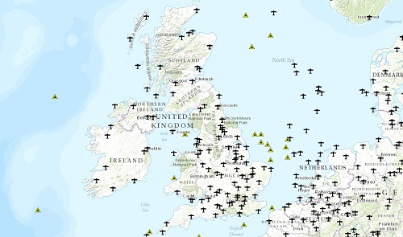
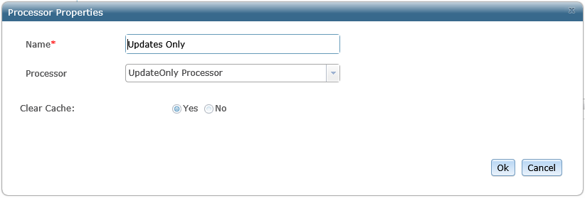

# Importing Current Weather data into GeoEvent extension for ArcGIS Server

Below are instructions for creating your own map of current weather (provided by NOAA) that is frequently updated through the GeoEvent extension for ArcGIS Server.  The regex Text Adapter and the Update Only Processor are both employed.

## Features

* Provides a test, with live data, for both the regex Text Adapter and the Update Only Processor.
* Demonstrates a tried-and-tested method for retrieving live, current weather data from stations around the world.

## Sections

* [Requirements](#requirements)
* [Configuration](#configuration)
* [Usage](#usage)
* [Licensing](#licensing)

## Requirements

* To run this sample, you will require access to an installation of ArcGIS for Server and a Managed Geodatabase or Datastore (or an organizational account on ArcGIS Online).
* See common [solutions-geoevent-java requirements](../../README.md#requirements).
* Also, you will need to ensure you have installed:
    * [regex Text Adapter](../../solutions-geoevent/adapters/regexText-adapter/README.md)
    * [Update Only Processor](../../solutions-geoevent/processors/updateOnly-processor/README.md)

## Configuration

* First, create an editable Feature Service that will act as the destination for the incoming weather data.
    *  Download the Current Weather Schema which is held within the map package above named BUOY_METAR.mpk within the BUOY_METAR.zip file.
    *  Copy this schema to an Enterprise Geodatabase, and ensure the Feature Classes are registered as versioned.
    *  Re-point the layers in the mxd to the feature classes you've just created in your Enterprise Geodatabase, and save the MXD.
    *  In the Catalog window in ArcMap, right click on the MXD and choose 'Share as a service'
    *  Publish the service, opting to enable Feature Access with editing, and naming the service 'CurrentWeather'
	
	*  If you are using the ArcGIS Datastore as your Managed Geodatabase the Feature Classes will copy to the DataStore when the service is published.
    
* Secondly, register your ArcGIS for Server with the GeoEvent Data Store in GeoEvent extension for Server using the GeoEvent Manager
    *  Navigate to 'Site' > 'GeoEvent Processor' > 'Data Stores' and, if your ArcGIS for Server connection is not already listed as registered, click 'Register ArcGIS Server' and register your server.

* Thirdly, you can import the required inputs, outputs and geoevent services by importing a single configuration file.
    *  Browse to `solutions-geoevent-java\data\configurations` and locate the `GeoEventConfig-METARandBUOY_10.3.1.xml` configuration file  This file is located [here](../configurations/GeoEventConfig-METARandBUOY_10.3.1.xml). It is also located within the BUOY_METAR.zip file.
    *  Open this file in a Text Editor (e.g. Notepad) and use the Replace function to find and replace the text '[ArcGIS Server Name]' with the name of your ArcGIS Server instance (created above). It may also be necessary to change the <path> entry (e.g. if your service resides in a folder named 'Environment', change <path>/</path> to <path>Environment/</path>. Save your changes.
    *  Navigate to ‘Site’ > ‘GeoEvent Processor’ > ‘Configuration Store’ and click ‘Import Configuration’.

* Fourth, check your inputs, services and outputs have started successfully
    *  In ArcGIS GeoEvent Processor Manager, navigate to 'Services' > 'Monitor' and check the status of the following:
        *  Outputs
            *  buoy-fs-out
            *  metar-fs-out
        *  GeoEvent Services
            *  BUOY
            *  METAR
        *  Inputs
            *  buoy-regexText-in
            *  metar-regexText-in
    *  Check that all have a status of STARTED, and start any that are not
    *  Note that if, for any reason, your outputs start after your geoevent services, or if they require some tweaking of parameters before they work, then the Update Only Processor may start filtering out data that it believes has already been received. Once you have your outputs working, it is therefore a good idea to clear the cache in the Update Only Processor within each of the METAR and BUOY GeoEvent Services. To do this, in the Update Only Processor Properties, click "Yes" to clear the cache, then 'OK', and then 'Publish' the services again.

*  Finally, view the service you created above in a map to see the stations with up-to-date weather information against them. In a web map, you can set your layers to refresh at an appropriate interval to ensure they show up-to-date information.

## Usage

*  Note that you should use NOAA's services in a responsible manner. This sample uses static files of recent updates that are published by NOAA every 1 - 5 minutes. The frequency of polling is pre-set to 5 minutes (300 seconds) for the purposes of demonstration. However, you should poll as infrequently as your use case allows in order not to expend NOAA's server resources unnecessarily.

*  Should you only be interested in a restricted set of data, such as:
    *  a small geographic area
    *  a certain set of weather stations
    *  a small subset of measurement parameters (e.g. only Temperature)
   ... then consider using NOAA's data query services in order to refine your input and so save on bandwidth. These services can output data as comma-separated values (CSV). Details of how to construct a URL to query these services can be found here:
    *  BUOY:  http://sdf.ndbc.noaa.gov/sos/
    *  METAR: https://aviationweather.gov/adds/dataserver
    *  An alternative would be to add Filter Processors (perhaps using GeoFences) to achieve the same effect in GeoEvent Processor itself. Your decision on the appropriate route to take should be based on a balanced view of the additional use of processing resources on NOAA's servers that frequent use of their query services would imply, against any savings in bandwidth that might be achieved.
   
 *  Having got up-and-running, you could now extend and enhance your use of the data using your existing GeoEvent Processor configuration skills. For example:
     *  Add filters or field reducers to restrict the data flowing through (e.g. to a geographic area or to just a few weather parameters)
     *  Add field calculators to change units (e.g. from Centigrade to Fahrenheit) or to calculate derivatives (e.g. Heat Index from Temperature and Relative Humidity)
     *  Use field calculators to identify the operational impacts of weather on activities such as "Parachute drops", outputting data, for example, in "traffic light" format (e.g. suitable / marginal / unsuitable)
     *  Create separate outputs for elements of weather data that are only relevant to certain user groups
     *  Alter your output connector to 'Add a feature' so as to accumulate data over time, then create a time-aware web map application so that changes in weather can be viewed over time
     *  Hook up to Terminal Aerodrome Forecast (TAF) data (https://aviationweather.gov/adds/dataserver/tafs.cache.csv for a static file of all recent updates or https://aviationweather.gov/adds/dataserver for the TAF query service).
     *  Anything else you can think of...
     
## Licensing

Copyright 2015 Esri

Licensed under the Apache License, Version 2.0 (the "License");
you may not use this file except in compliance with the License.
You may obtain a copy of the License at

   [http://www.apache.org/licenses/LICENSE-2.0](http://www.apache.org/licenses/LICENSE-2.0)

Unless required by applicable law or agreed to in writing, software
distributed under the License is distributed on an "AS IS" BASIS,
WITHOUT WARRANTIES OR CONDITIONS OF ANY KIND, either express or implied.
See the License for the specific language governing permissions and
limitations under the License.

A copy of the license is available in the repository's
[license.txt](../../license.txt) file.
