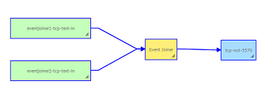

# Event Joiner Processor

The Event Joiner Processor joins 2 or more GeoEvents with different GeoEvent Definitions based on a common attribute. Events are generated on a first come first serve basis. The processor caches incoming events until one event from each incoming event definition is received. Attributes with identical names will be grouped in the geoevent output with the exception of the join field which will be made into the trackid of the output event.

## Sections

* [Requirements](#requirements)
* [Building](#building)
* [Installation](#installation)
* [Testing](#testing)
* [Licensing](#licensing)

## Requirements

* See common [solutions-geoevent-java requirements](../../../README.md#requirements).
* The ArcGIS Runtime for Java SDK is required in order to run the standalone Maven Tests included with this project.

## Building 

* See the [solutions-geoevent-java instructions](../../../README.md#instructions) for general instructions on 
    * verifying your Maven installation
    * setting the location of GeoEvent Processor and GeoEvent Processor SDK repositories
    * and any other common required steps
* Open a command prompt and navigate to `solutions-geoevent-java/solutions-geoevent/processors/eventjoiner-processor`
    * Enter `mvn install` at the prompt.

## Installation

* Install the Event Joiner Processor.
    * Browse to `solutions-geoevent-java/solutions-geoevent/10.3.0/processors/eventjoiner-processor/target` (this directory is created when you execute mvn install).
    * Copy the .jar file and paste it into the deploy folder in the GeoEvent Processor install directory ([GeoEvent Processor install location]\deploy\ -- default location is C:\Program Files\ArcGIS\Server\GeoEventProcessor\deploy).

## Testing

### Validating the Installation
 
* See the [solutions-geoevent-java validation instructions](../../../README.md#validating-install).
    * Ensure the Event Joiner Processor exists.

### Testing with Simulated Test Data

#### Deploying the Test Configuration

If you have already deployed the test configuration you may move on to Testing the Component

In GeoEvent Extension Manager 

* Go to the Site >> Configuration Store Tab. 
* Click the 'Import Configuration' button. 
* Select 'Choose File'
* Browse to the ./solutions-geoevent-java/data/configurations/ directory 
* Select the SolutionsComponentTestConfig.xml 
* Click 'Open' in the dialog. 
* Click 'Next'. 
* When prompted choose 'Import Configuration'. 

The test service configuration will be deployed to your instance of GeoEvent.

#### Testing the Component

The Introduction to GeoEvent tutorial has a simple TCP-Console application that will be used for most of the tests. It can be found [here](http://www.arcgis.com/home/item.html?id=b6a35042effd44ceab3976941d36efcf).

You will use the EventJoiner-Test service from the Solutions Test Configuration to test the functionality of the Event Joiner Processor.
* Open the EventJoiner-Test service in GEE Manager. 
* Click on the eventjoiner1-tcp-txt-in Input and expand the 'Advanced' tab. Note that the input uses TCP port 5603.
* Click on the eventjoiner2-tcp-txt-in Input and expand the 'Advanced' tab. Note that the input uses TCP port 5604.
* Open 2 instances of the ArcGIS GeoEvent Simulator (this is installed with GeoEvent Extension and can be found at the GeoEvent Extension install location).
* Make sure the Server points to the server on which GeoEvent Extension is deployed (default is local host).
* In the upper right, change the port to 5603 and  click the button with the red X to connect (Note: if you cannot connect the server is not listening on that port. This may be because the Input in GeoEvent extension has not been started).
* Make sure 'File' is selected in the combo box on the upper left.
* Click the 'Load File' button in the upper right.
* In the new dialog, click the file folder button in the upper right.
* Browse to the ./solutions-geoevent-java/data/simulation-files/ directory.
* Select eventjoiner1.csv and click 'Open'
* Click the 'Load' button. In the Preview Edits window you will see 1 record.
* Repeat these steps in the other simulator substituting 6304 in the port and the eventjoiner2.csv for the simulation file.
* Browse to the directory of the TCP-Console application (if you downloaded it from the tutorial it will be at ./IntroductionToGeoEvent/utilities/tcp-server-app).
* Double click TCPServerApp.bat (the application will not start if no services are listening on port 5570 - if you have deployed the test configuration an output service has been configured to listen on this port. Check that the Output tcp-out-5570 has been deployed and started).
* In 1st GeoEvent Simulator click the 'Step' button.
* In 2nd GeoEvent Simulator click the 'Step' button.
* In the TCP-console you will see that the Received Event (Event Definition name) is join-events with a comma separated list of values. Note that the url values are represented in brackets indicating a joined attribute.
* Try stepping the 1st simulator multiple times. Note that no event is produced in the console.
* Next step the 2nd simulator. Notice that the console outputs an event, demonstrating the cacheing behavior. Step an equal number of times in the 2nd simulator as in the first simulator in the previous step. Note that an event is created for each.

## Licensing

Copyright 2014 Esri

Licensed under the Apache License, Version 2.0 (the "License");
you may not use this file except in compliance with the License.
You may obtain a copy of the License at

   [http://www.apache.org/licenses/LICENSE-2.0](http://www.apache.org/licenses/LICENSE-2.0)

Unless required by applicable law or agreed to in writing, software
distributed under the License is distributed on an "AS IS" BASIS,
WITHOUT WARRANTIES OR CONDITIONS OF ANY KIND, either express or implied.
See the License for the specific language governing permissions and
limitations under the License.

A copy of the license is available in the repository's
[license.txt](../../../license.txt) file.

